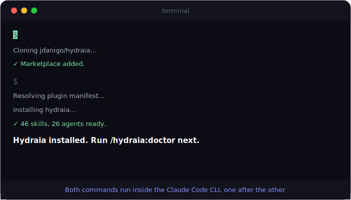

# Hydraia


🇬🇧 [English](README.md) · 🇪🇸 Español

Un arnés de desarrollo agéntico personal para Claude Code. Un solo comando ejecuta
todo el pipeline de la funcionalidad: **colabora contigo en el diseño** (lluvia de
ideas, enfoques, spec) y luego **construye de forma autónoma** — planifica, ejecuta,
revisa dos veces y verifica sin niñeras paso a paso y sin decirle qué modelo o skill usar.

```
/hydraia:feature add rate limiting to the public REST API
```

Tú te quedas en Opus 4.8; Hydraia decide todo lo demás — cuándo hacer lluvia de
ideas, cuándo planificar, cuándo bajar a Sonnet para la ejecución, qué revisores
correr, qué gates de seguridad exigir.

---

## Vista visual

Cómo un solo comando conduce todo el pipeline — las 7 fases (diseño interactivo →
plan congelado → construcción autónoma), el reparto de modelo Opus/Sonnet, y qué
fases corre cada comando principal.


> Fuente editable: [`docs/diagrams/hydraia-pipeline-es.excalidraw`](docs/diagrams/hydraia-pipeline-es.excalidraw) — arrástralo a [excalidraw.com](https://excalidraw.com) para ajustarlo.

---

## Tabla de contenidos

- [Por qué Hydraia](#por-qué-hydraia)
- [Qué hace, automáticamente](#qué-hace-automáticamente)
- [Capacidades destacadas](#capacidades-destacadas)
- [Comandos](#comandos)
- [Ejemplos resueltos](#ejemplos-resueltos)
- [Planifica una vez, ejecuta donde sea](#planifica-una-vez-ejecuta-donde-sea)
- [Casos de uso](#casos-de-uso)
- [Cómo sacarle el máximo provecho a Hydraia](#cómo-sacarle-el-máximo-provecho-a-hydraia)
- [Cómo funciona por dentro](#cómo-funciona-por-dentro)
- [Seguridad (incorporada)](#seguridad-incorporada)
- [Spec-drive, forzado](#spec-drive-forzado)
- [El único paso de configuración](#el-único-paso-de-configuración)
- [Prerrequisitos](#prerrequisitos)
- [Instalación](#instalación)
- [Estructura del repo](#estructura-del-repo)
- [Notas](#notas)

---

## Por qué Hydraia

Claude Code en crudo es poderoso, pero requiere estar encima. **Tú** decides cuándo
planificar, cuándo hacer threat-modeling, qué revisor correr, cuándo bajar a un
modelo más barato — y cargas con todo eso en una sola ventana de contexto que se
infla a medida que crece la tarea. Te saltas un paso bajo presión de tiempo y la
calidad se degrada en silencio.

Hydraia elimina la niñera. **Un solo comando ejecuta un pipeline fijo, no
negociable** — pensar → diseño + threat model → planificar → ejecutar → doble
revisión → verificar — con cada decisión de modelo, skill y revisor ya tomada. Tú
te quedas en Opus 4.8 y lees una línea por fase.

El punto no es "un agente que programa". Es la **disciplina que aplicarías en tu
mejor día, aplicada en cada corrida** — el threat model que te saltarías con
prisa, el plan que harías a las carreras, el segundo revisor al que nunca
llamarías, las pruebas que pensabas escribir. Hydraia no te deja saltártelos.

> **Sin Hydraia:** elegir un modelo, acordarte de planificar, acordarte de hacer
> threat-modeling, escribirlo, acordarte de revisar, acordarte de correr
> seguridad, acordarte de probar — cada paso manual, cada paso saltable.
>
> **Con Hydraia:** `/hydraia:feature add rate limiting to the public API` — y
> todo corre, en orden, sin supervisión.

---

## Qué hace, automáticamente

| Fase | Qué pasa | Modelo |
|-------|--------------|-------|
| -1 · Triage | Se detecta y enruta la intención: feature · historia de usuario (PO) · bug · perf/DB · greenfield · review; ante ambigüedad, pregunta, nunca asume | Opus 4.8 |
| 0 · Contexto | Grafo de código sincronizado (hook de sesión) + consultado; cualquier PDF convertido a markdown | Opus 4.8 |
| 1 · Pensar | Gate forzado de pensar-antes-de-programar (karpathy-guidelines) | Opus 4.8 |
| 2 · Diseño | Lluvia de ideas → spec exhaustivo + threat model | Opus 4.8 |
| 3 · Plan | Plan detallado + ciclo de auto-revisión (máx. 2 pasadas) | Opus 4.8 |
| 4 · Ejecutar | Sub-agente nuevo por tarea; watchdog de heartbeat re-despacha agentes colgados; inteligencia de UI en trabajo de frontend | Sonnet 5 |
| 5 · Revisar | Profundidad elegida al congelar el plan (Full/Lite/Custom, piso de seguridad siempre activo) — **Pasada 1** de toda la rama + **Pasada 2** acotada al diff + gate de seguridad, deduplicado | Opus (+ Sonnet/Haiku para lo mecánico) |
| 6 · Verificar | Corre pruebas, confirma contra el spec, escaneo de secretos/deps, resumen breve o detallado | Opus 4.8 |

La disciplina de tokens (comunicación interna comprimida, estilo `caveman`) corre
en segundo plano a través de todas las fases — nunca toca el código, los planes,
ni tu resumen.

---

## Capacidades destacadas

La tabla del pipeline de arriba es *qué* corre. Estas son las cosas que hacen que
el resultado sea distinto de pedirle a Claude Code que "construya una feature" por
tu cuenta — la mayoría son pasos que nunca correrías a mano en un día normal.

| Capacidad | Por qué importa |
|-----------|----------------|
| **Contexto de grafo de código, no lecturas a ciegas** | Cada corrida empieza consultando un índice de `codegraph` — estructura, sitios de llamada, radio de impacto — en lugar de volcar archivos al contexto. Más barato, más preciso, y sabe qué va a romper un cambio *antes* de tocarlo. Consúltalo directamente con `/hydraia:graph`. |
| **Ciclo de diseño adversarial** | Antes de congelar el spec, Hydraia hace red-team de su **propio** diseño: supuestos no declarados, un enfoque más simple que ignoró, modos de falla, huecos de seguridad que el threat model pasó por alto. Atrapar un fallo de diseño aquí es ~10× más barato que en la revisión. |
| **Seguridad en tres gates, no uno** | Threat model en **diseño** (antes de que exista código) → escaneo cross-stack + revisión OWASP en **código** → auditoría de secretos/deps/producción al **cierre**. Cualquier hallazgo de severidad alta bloquea la corrida. |
| **Planes que se auto-revisan** | El plan se critica a sí mismo (hasta 2 pasadas) buscando huecos, acoplamiento oculto, pruebas faltantes y cambios demasiado amplios — antes de escribir una sola línea. |
| **División de modelos consciente del costo** | Opus 4.8 hace el trabajo de juicio (diseño, plan, ambas revisiones); la ejecución mecánica se delega a sub-agentes de Sonnet 5. Pagas por Opus solo donde el razonamiento realmente importa. |
| **Sub-agente nuevo por tarea** | Cada ejecutor recibe solo su tarea + contexto del grafo — nunca tu historial de sesión. Sin contaminación de contexto, sin deriva en una corrida larga. |
| **Doble revisión de código** | Una pasada de revisor de toda la rama, y luego un panel: 8 revisores específicos de stack (Go, Angular, React, Vue, TS, Python, Java, C#) más los transversales (seguridad, fallos silenciosos, performance, tipos, base de datos). |
| **Corridas reanudables** | Cada corrida escribe un log durable con un checklist de fases. Si se interrumpe — crash, laptop cerrada, sesión matada — `/hydraia:resume` la retoma exactamente donde se detuvo. |
| **Artefactos persistentes** | Specs y planes se guardan bajo `docs/hydraia/` — revisables, comparables con diff, reutilizables y auditables después. |
| **Tú eliges la profundidad** | Al congelar el plan Hydraia pregunta cuánta ceremonia de review amerita el cambio (Full / Lite / Custom) y si quieres un resumen breve o detallado — así un arreglo trivial no paga un doble review completo. El piso de seguridad nunca se omite. |
| **Watchdog de agentes colgados** | Los ejecutores emiten heartbeats; si uno se cuelga sin commitear, el pipeline lo re-despacha automáticamente en vez de esperar a que lo empujes — y solo reporta un bloqueo real tras agotar los reintentos. |
| **QA como artefacto commiteado** | El QA funcional se escribe en `docs/hydraia/qa/` y se commitea — una matriz de casos Given/When/Then revisable que puedes leer y conservar, no QA hecho en la cabeza del modelo. |
| **Telemetría consciente de sub-agentes** | El dashboard local atribuye tokens y modelos a cada sub-agente (no solo a la sesión principal), con entrada/salida por modelo y un desglose main-vs-sub por corrida. |
| **Dale un PDF** | Apúntalo a un export de Jira o un PDF de design-doc; `markitdown` lo convierte a markdown antes de que entre al contexto. Sin copiar y pegar. |
| **Disparador en lenguaje simple** | "add a `--dry-run` flag to the CLI…" corre automáticamente todo el pipeline — no requiere slash command. |
| **Bilingüe** | Responde en inglés o Español (se pregunta una vez por corrida). Código, commits, specs y planes se mantienen en inglés y portables. |

---

## Comandos

| Comando | Fases que corre | Qué hace |
|---------|-----------|--------------|
| `/hydraia:feature <desc>` | 0–6 | Pipeline completo: contexto → pensar → diseño+threat-model → plan+auto-revisión → ejecutar (Sonnet 5) → doble revisión + gate de seguridad (Opus 4.8) → verificar + escaneo de secretos/deps |
| `/hydraia:plan <desc>` | 0–3 | Contexto + diseño + threat model + plan detallado (con auto-revisión), luego **se detiene**. Nada se ejecuta. |
| `/hydraia:story <story>` | -1–3 | Análisis de Product Owner de una historia de usuario (INVEST, preguntas de ambigüedad, criterios de aceptación numerados) → spec → casos QA + matriz de trazabilidad → plan congelado, luego **se detiene**. Nada se ejecuta. |
| `/hydraia:perf <symptom>` | -1–6 | Corrida de performance medición-primero: baseline → diagnóstico guiado por profiling (`perf-engineer`) → spec con objetivo numérico → implementar → **re-medir** en verify. |
| `/hydraia:db <symptom>` | -1–6 | Corrida de cuello de botella de BD: detección de motor, evidencia de solo-lectura (EXPLAIN, stats, locks), hallazgos por taxonomía, migraciones expand-contract — `db-performance-tuner` como principal. |
| `/hydraia:architect <idea>` | -1–6 | Greenfield: elicitación guiada → propuestas de arquitectura → stack confirmado → contrato de API → ADRs → pipeline de build completo. |
| `/hydraia:e2e [focus]` | — | Genera + corre una suite E2E de flujos críticos con Playwright (framework auto-detectado). |
| `/hydraia:devops <request>` | — | Redacta CI/CD, Docker, o IaC — deploy y secretos marcados para aprobación humana. |
| `/hydraia:observability <request>` | — | Instrumenta logs/métricas/traces/alertas — OTel-first, nunca registra secretos/PII. |
| `/hydraia:docs [focus]` | — | Sincroniza README, docs de API, CHANGELOG, índice de ADR con el código — reporta drift. |
| `/hydraia:review [focus]` | 5–6 | Doble revisión de código + gate de seguridad sobre la **rama actual**. El código ya existe. |
| `/hydraia:graph <query>` | — | Consulta el grafo de código (sitios de llamada, radio de impacto) sin correr el pipeline. |
| `/hydraia:doctor` | — | Valida, instala y actualiza dependencias externas (`codegraph`, `markitdown`), con consentimiento. **Córrelo dentro del CLI de Claude Code** (ver [Instalación](#instalación)) — no es un comando de terminal. |
| `/hydraia:dashboard [port]` | — | Lanza un dashboard web local (127.0.0.1): estado del plugin, telemetría de uso, y modos de corrida editables. Servidor Node sin dependencias; todos los datos se quedan en tu máquina. |
| `/hydraia:resume [run]` | reanuda | Continúa un pipeline interrumpido desde la última fase incompleta. |

El skill `hydraia` también se **auto-dispara** cuando pides construir/agregar/
implementar una funcionalidad en lenguaje simple — no requiere slash command.
`/hydraia:feature` es el punto de entrada explícito, sin ambigüedad.

---

## Ejemplos resueltos

### 1. Entregar una funcionalidad completa de punta a punta

```
/hydraia:feature add rate limiting to the public REST API — 100 req/min
per API key, returning 429 with a Retry-After header
```

Lo que verás, aproximadamente una línea por fase:

```
Running the Hydraia pipeline.
[0] Graph synced. Queried API middleware chain + route registration.
[1] Goal restated, assumptions listed, simplest approach chosen
    (token bucket per key, shared store).
[2] Spec written. Threat model: bypass via missing/rotated keys,
    memory exhaustion from unbounded key space, clock skew across nodes.
    Mitigations folded into spec.
[3] Plan saved: docs/hydraia/plans/2026-07-02-api-rate-limiting.md
    Self-review pass A found a missing test for the 429 header → revised.
[4] Executor #1: token-bucket store. Executor #2: middleware + headers.
    Executor #3: tests. All committed.
[5] Pass 1 (branch review) + Pass 2 (typescript-reviewer, security-reviewer,
    silent-failure-hunter) + security-scan/security-review. 1 material
    finding fixed.
[6] Tests green. Spec + mitigations confirmed. repo-scan/production-audit
    clean. Done.
```

### 2. Solo planificar — revisa el enfoque antes de que se escriba código

Úsalo cuando quieras validar el diseño y el plan archivo-por-archivo primero.

```
/hydraia:plan migrate the session cache from in-memory to Redis with
a 30s TTL, keeping the current interface
```

Se detiene después de la Fase 3 con un plan congelado bajo `docs/hydraia/plans/`.
Nada se ejecuta. Corre `/hydraia:feature` (o entrégale el plan a ejecutores) cuando
estés conforme.

### 3. Revisar una rama existente que no construiste con Hydraia

```
/hydraia:review the auth module
```

Corre solo las Fases 5–6 sobre la rama actual: ambas pasadas de revisión, el gate
de seguridad cross-stack, y el escaneo de secretos/deps previo al cierre. Hallazgos
ordenados por severidad; los hallazgos de seguridad de severidad alta se tratan
como bloqueantes. El foco opcional (`the auth module`) acota la atención.

### 4. Entender el radio de impacto antes de tocar nada

```
/hydraia:graph what calls parseConfig and what would break if I change
its return type
```

Consulta pura al grafo de código — sitios de llamada, dependientes, radio de
impacto. Sin pipeline, sin ediciones. Útil antes de decidir si un cambio es
quirúrgico o expansivo.

### 5. Sin slash command para nada

```
add a --dry-run flag to the CLI that prints planned changes without
writing them
```

El skill `hydraia` reconoce la frase "add … feature" y corre el mismo pipeline
completo. `/hydraia:feature` simplemente elimina la ambigüedad.

---

## Planifica una vez, ejecuta donde sea

El plan que escribe la Fase 3 es deliberadamente **agnóstico de agente**: cada
archivo a tocar, el cambio por archivo, las pruebas, y cómo verificar — escrito
para un implementador sin *ningún* contexto previo. Eso lo convierte en un
**artefacto de entrega portable**, no solo una nota interna. Lo cual habilita una
forma de trabajar optimizada en costo y velocidad: gasta el modelo caro solo en el
juicio, y empuja el volumen pesado en tokens a donde quieras.

**1 · Planifica en Opus (juicio).**

```
/hydraia:plan add rate limiting to the public REST API — 100 req/min per
API key, 429 with Retry-After
```

Se detiene tras la Fase 3 con un plan congelado en
`docs/hydraia/plans/2026-07-02-api-rate-limiting.md` — tareas numeradas e
independientes, cada una autocontenida.

**2 · Ejecuta las tareas con lo que sea más barato / rápido.** Las tareas del plan
son independientes por diseño, así que repártelas. Cada ejecutor necesita solo su
bloque de tarea más el repo — nunca el contexto de planificación.

| Ejecutor | Cómo lo corres | Bueno para |
|----------|----------------|----------|
| Los sub-agentes de Sonnet propios de Hydraia | corre `/hydraia:feature <same request>` — planifica y ejecuta con sub-agentes de Sonnet automáticamente | totalmente sin supervisión, sesión única |
| **Codex CLI** | entrégale un bloque de tarea del archivo de plan a `codex` en otra terminal | ejecución en paralelo, las fortalezas de un modelo distinto |
| **Gemini** | pega un bloque de tarea en Gemini | un tercer modelo / capacidad de tier gratuito |
| Una segunda sesión de **Claude** (Sonnet) | abre otra sesión, dale la tarea 2 mientras la sesión 1 corre la tarea 1 | paralelismo real entre tareas independientes |

**3 · Revisa en Opus (juicio otra vez).**

```
/hydraia:review
```

Corre las Fases 5–6 sobre la rama — doble revisión + gate de seguridad cross-stack
+ verify — **sin importar quién escribió el código.** ¿Codex escribió la tarea 3?
¿Una sesión de Gemini escribió la tarea 5? No importa; la revisión y la barra de
seguridad son idénticas.

**Por qué esto gana:**

- **Costo de tokens.** Opus — el modelo caro — solo toca las dos fases donde el
  juicio realmente vale la pena: planificación y revisión. El tramo pesado en
  tokens (ejecución) corre en modelos más baratos, otras herramientas, o tiers
  gratuitos.
- **Paralelismo.** Las tareas independientes del plan corren *al mismo tiempo* en
  distintos agentes/terminales en lugar de una a la vez dentro de un solo contexto.
- **Sin inflado de contexto.** Cada ejecutor arranca limpio con solo su tarea, así
  que ninguno degrada como lo hace una sesión larga.
- **Diversidad de modelos, una sola barra de calidad.** Distintos ejecutores
  atrapan cosas distintas; el gate de revisión de Opus normaliza el resultado sin
  importar la fuente.

No tienes que salir de Claude para beneficiarte — `/hydraia:feature` ya hace
internamente la división **Opus-planifica → Sonnet-ejecuta → Opus-revisa**. Ir
multi-agente simplemente extiende ese mismo principio a través de herramientas y
terminales.

---

## Casos de uso

| Situación | Recurre a |
|-----------|-----------|
| Funcionalidad nueva, la quieres planificada, construida, revisada y verificada de una sola vez | `/hydraia:feature` |
| Una historia de usuario o ticket que necesita análisis de nivel PO antes de construir — INVEST, criterios de aceptación, casos QA trazados a cada AC | `/hydraia:story`, luego `/hydraia:feature` |
| Un endpoint o job se puso lento y lo quieres arreglado con pruebas, no con adivinanzas | `/hydraia:perf` — baseline primero, objetivo numérico, re-medido en verify |
| Queries lentas, timeouts de lock, agotamiento de conexiones, o una pregunta de índice | `/hydraia:db` — evidencia EXPLAIN-primero, migraciones expand-contract |
| Una app o servicio completamente nuevo, diseñado antes de la primera línea de código | `/hydraia:architect` — elicitación, opciones de arquitectura, stack, contrato de API, ADRs |
| Una superficie de API que debería diseñarse antes de implementar | `api-design` corre dentro de las corridas de greenfield/feature — OpenAPI/GraphQL/gRPC contract-first |
| Cobertura de pruebas que puedas trazar: cada criterio de aceptación → caso → archivo de prueba | activo por defecto (`qaFunctional`) — el plan no puede congelarse con un AC sin cubrir |
| Cambio riesgoso — quieres fijar el diseño + threat model antes de comprometer esfuerzo | `/hydraia:plan`, luego `/hydraia:feature` |
| Heredaste una rama (tuya o de un compañero) y quieres una revisión rigurosa y consciente de seguridad | `/hydraia:review` |
| Estimar alcance / decidir si un refactor es seguro | `/hydraia:graph` |
| Código sensible a seguridad (auth, input de usuario, llamadas externas) donde un fallo a nivel de diseño es caro | cualquier corrida del pipeline — el threat model + 3 gates de seguridad siempre están activos |
| Trabajo de frontend | `/hydraia:feature` — los ejecutores consultan automáticamente `ui-ux-pro-max` para estilo, paleta, escala tipográfica, a11y |
| Convertir un ticket de Jira exportado como PDF en código entregado | `/hydraia:feature path/to/ticket.pdf …` — se convierte a markdown antes de planificar |
| Servicio/módulo greenfield desde cero | `/hydraia:architect` — `greenfield-architect` guía elicitación → arquitectura (`architect` + `code-architect`, `microservices-architect` para divisiones) → stack → contrato de `api-design` → ADRs antes del spec |
| Feature grande donde te preocupa el costo de tokens | cualquier corrida del pipeline — la división Opus/Sonnet mantiene automáticamente al modelo caro fuera del trabajo mecánico |
| Incorporarte a un repo que nunca has visto | `/hydraia:graph` — mapea estructura, sitios de llamada, y dependientes sin leer todo |
| Exigir pruebas en el trabajo de un equipo | `/hydraia:feature` — TDD en la Fase 4, conformidad con spec + corrida de pruebas en el gate de verify de la Fase 6 |
| Una corrida se interrumpió (crash, sesión cerrada) | `/hydraia:resume` — continúa desde la última fase incompleta |
| Visto bueno previo al merge de un PR de otra persona | `/hydraia:review` — doble revisión + gate de seguridad cross-stack, hallazgos ordenados por severidad |
| Un refactor que podría expandirse por todo el codebase | `/hydraia:graph` primero (radio de impacto), luego `/hydraia:plan` para acotarlo antes de comprometer esfuerzo |

---

## Cómo sacarle el máximo provecho a Hydraia

Pequeños hábitos que elevan considerablemente la calidad de cada corrida:

1. **Empieza la sesión en Opus 4.8.** La única palanca que tocas. Opus hace el
   diseño y ambas revisiones; delega la ejecución a Sonnet por su cuenta. En un
   modelo más débil el pipeline igual corre, solo que con un techo más bajo.
2. **Corre `/hydraia:doctor` una vez.** Instala `codegraph` y `markitdown`. El
   contexto del grafo es donde vive gran parte del valor — sin él, la Fase 0 cae
   a lecturas a ciegas.
3. **Escribe la solicitud como un ticket, no como un deseo.** Meta + restricciones
   + criterios de aceptación. `add rate limiting — 100 req/min per API key, 429
   with Retry-After` produce un spec y threat model mucho más precisos que `add
   rate limiting`. Mientras más concreto el input, más ajustada cada fase
   posterior.
4. **Usa `/hydraia:plan` primero en algo riesgoso o costoso.** Apruebas el diseño
   y el plan archivo-por-archivo antes de gastar un solo token de ejecución. Luego
   corre `/hydraia:feature` cuando estés conforme.
5. **Apúntalo al PDF.** Un export de Jira o un design doc — pasa la ruta en vez de
   copiar y pegar. Se convierte y se lee por completo.
6. **Revisa el radio de impacto antes de comprometerte con un refactor.**
   `/hydraia:graph what calls X and what breaks if I change it` te dice
   quirúrgico vs. expansivo en una sola consulta.
7. **Déjalo terminar.** El pipeline está construido para correr sin supervisión —
   el valor está concentrado justo en las fases (threat model, pasada de diseño
   adversarial, segunda revisión) que te saltarías a mano.

---

## Cómo funciona por dentro

Hydraia es una capa delgada de orquestación sobre skills empaquetados y probados
en batalla. No contiene lógica de negocio propia — decide **qué corre, en qué
orden, en qué modelo.** Cada skill y agente que usa viene incluido dentro del
plugin (`skills/`, `agents/`) — nada externo que instalar salvo dos binarios (ver
Prerrequisitos).

### El circuito, por comando

Cada corrida se divide en el plan congelado: una **mitad interactiva** donde el
diseño ocurre contigo, y una **mitad autónoma** que construye sin interrupción.

```
/hydraia:feature <desc>          full pipeline
   Language gate · Model guard
  -1 Triage    intent → route: feature · story · bug · perf/DB ·
               greenfield · review (ambiguous → asks, never assumes)
   ┌─ INTERACTIVE (pauses allowed — this is where design happens) ─┐
   0 Context   codegraph query + PDF→md
   1 Think     karpathy gate · clarifying questions
   2 Design    brainstorm (questions → 2-3 approaches → present →
               YOUR approval) → write spec  docs/hydraia/specs/…
               + threat model + adversarial pass
   3 Plan      writing-plans (exact Files, Interfaces, TDD steps,
               literal content — the Haiku test) + qa-functional cases
               → self-review (rejects thin plans) → freeze plan
               → ARM gate (.active-plan)   ← needs spec + plan
   └─ AUTONOMOUS (never pause; only a real blocker stops it) ───────┐
   4 Execute   fresh hydraia-executor (Sonnet) per task · qa-automation
   5 Review    branch review (Opus) + reviewer panel + security gate
   6 Verify    run REAL build/tests · QA matrix · E2E gate · docs sync
               · repo-scan/prod-audit → DISARM gate · print credits

/hydraia:plan <desc>     Phases 0→3 only, then STOP
   writes spec + frozen plan, does NOT arm the gate, writes no code.
   The human review point before building. Then run /hydraia:feature.

/hydraia:story <story>   Phases -1→3, PO-first, then STOP
   story-analysis (INVEST, ACs) → spec → QA cases → frozen plan.

/hydraia:perf | :db <symptom>   measurement-first tuning route
   baseline → perf-engineer / db-performance-tuner → numeric target
   → build → Phase 6 re-measures against it.

/hydraia:architect <idea>   greenfield route
   greenfield-architect: elicit → architecture → stack → api-design
   contract → ADRs → full build.

/hydraia:review [focus]  Phases 5→6 on the current branch
   double review + cross-stack security gate + verify — no matter who
   (or what agent) wrote the code. Touches no earlier phase.

/hydraia:e2e | :devops | :observability | :docs   opt-in specialists
   e2e-runner · devops-engineer · sre-observability · docs-engineer.

/hydraia:graph <query>   codegraph only — call sites, dependents, blast
   radius. No pipeline, no edits.

/hydraia:doctor          validate / install / update codegraph + markitdown
/hydraia:resume [run]    read run log → continue from the last incomplete phase
```

**El gate de spec-drive** (`hooks/gate.sh`, cualquier repo con un `docs/hydraia/`)
está presente en todo esto — una edición de código fuente se bloquea a menos que
un plan esté congelado (`.active-plan`), una edición rápida haya sido aprobada
por un humano (`.quick-approved`), o hayas puesto `HYDRAIA_ALLOW_DIRECT=1`.
Markdown y los artefactos del pipeline están exentos.

**El skill es el contrato.** `skills/hydraia/SKILL.md` define las fases y los dos
modos: prohíbe preguntarle al usuario qué modelo/skill/revisor usar, exige un
diálogo de diseño real en las Fases 1–3, y prohíbe pausar una vez que la
ejecución empieza (Fases 4–6). Esto es lo que hace que un solo comando conduzca
toda la corrida.

**Dos subagentes cargan con el peso:**

- `hydraia-executor` (`model: sonnet`) — despachado nuevo **por tarea** en la
  Fase 4. Recibe solo la tarea + contexto del grafo, nunca el historial de
  sesión. Cambios quirúrgicos, pruebas, commits. Consulta `ui-ux-pro-max` para
  cualquier UI. Modelo más barato donde el trabajo es mecánico.
- `hydraia-reviewer` (`model: opus`) — Fase 5 pasada 1. Revisa **toda la rama**
  contra el spec, corrección, acoplamiento oculto, adecuación de pruebas,
  sobre-ingeniería.

**División de modelos, en resumen:** la sesión principal se queda en Opus 4.8
para todo el trabajo pesado en juicio (pensar, diseñar, planificar, ambas
pasadas de revisión). La ejecución se *delega* a Sonnet 5 — la sesión principal
nunca cambia su propio modelo, despacha sub-agentes ejecutores cuyo modelo está
fijado en su frontmatter.

**Los skills empaquetados hacen el razonamiento real** (`skills/`, todos MIT,
licencias en `LICENSES/`):

| Fase | Skill(s) empaquetado(s) usado(s) |
|-------|------------------------|
| -1 Triage | tabla de enrutamiento en `hydraia`; `story-analysis`, `performance-tuning`, `db-optimization`, `greenfield-architect`, `systematic-debugging` según la ruta |
| 1 Pensar | `karpathy-guidelines` |
| 2 Diseño | `brainstorming`; `api-design`, `adr`, `microservices-architect` en greenfield |
| 3 Plan | `writing-plans` + `qa-functional` (casos Given/When/Then + matriz de trazabilidad) |
| 4 Ejecutar | `subagent-driven-development`, `test-driven-development`, `ui-ux-pro-max`, patrones de stack (`react`/`node`/`dotnet`/`python`/`go`/`springboot`), `qa-automation`, `e2e-testing` |
| 5 Revisar | `requesting-code-review`, `receiving-code-review`, agentes revisores ECC, `security-scan`, `security-review` |
| 6 Verificar | `verification-before-completion`, `repo-scan`, `production-audit`; matriz QA + gate E2E (`e2e-runner`) + sincronización de docs (`docs-engineer`) |
| todas | `caveman` — comprime solo la comunicación interna/entre subagentes |

**El contexto viene del grafo de código, no de lecturas a ciegas.**
`hooks/preflight.sh` corre `codegraph sync` (o `index` en la primera corrida)
para que la Fase 0 pueda consultar estructura, sitios de llamada, y radio de
impacto de forma barata. Los PDF (specs, tickets) se convierten con
`markitdown` antes de entrar al contexto — nunca bytes crudos.

**Los artefactos del plan persisten.** Cada plan se escribe en
`docs/hydraia/plans/YYYY-MM-DD-<feature>.md` y se congela solo después de que
el ciclo de auto-revisión converge (máx. 2 iteraciones).

---

## Seguridad (incorporada)

La seguridad se aplica en tres puntos, no solo al final:

- **Diseño (Fase 2):** threat model sobre el radio de impacto del grafo de
  código — superficie de ataque, datos PII/financieros, authN/authZ, categorías
  OWASP — incorporado al spec para que las mitigaciones se vuelvan tareas del
  plan, no ocurrencias tardías.
- **Revisión (Fase 5):** `security-scan` + `security-review` cross-stack (OWASP,
  secretos, inyección, dependencias vulnerables) cubriendo Node, C#, React, y
  Angular; más `springboot-security` / `django-security` cuando el stack
  coincide. Los hallazgos de severidad alta bloquean el merge.
- **Cierre (Fase 6):** `repo-scan` + `production-audit` para secretos
  hardcodeados, dependencias vulnerables, y huecos de preparación para
  producción.

---

## Spec-drive, forzado

"Nunca te saltes una fase" no es solo un prompt que Hydraia espera que el modelo
obedezca — es un **gate en tiempo de ejecución**. Un hook `PreToolUse`
(`hooks/gate.sh`) bloquea cualquier edición de código fuente hasta que la Fase 3
congela un plan. Diseño-antes-que-código deja de ser aspiracional: el modelo
literalmente no puede escribir código antes de que existan el spec y el plan.

- **Alcance.** Solo se aplica en repos que usan Hydraia (aquellos con un
  directorio `docs/hydraia/`). Markdown y los propios artefactos del pipeline
  (specs, planes, logs de corrida) están exentos, así que escribir el plan
  nunca se bloquea.
- **La decisión de saltárselo es tuya, no del modelo.** El costo de tokens o
  "esto se ve trivial" nunca es una razón válida para que el modelo se salte el
  pipeline por su cuenta. Hay exactamente dos formas sancionadas de saltárselo:

  1. **Bypass duro (tú, de antemano).** Configura una variable de entorno en tu
     shell — infalsificable por el modelo, ya que no puede cambiar el entorno
     del proceso en el que corre el hook:

     ```bash
     export HYDRAIA_ALLOW_DIRECT=1   # allow direct edits; unset to re-arm the gate
     ```

  2. **Modo rápido (por cambio, aprobado por un humano).** Ante un cambio
     genuinamente trivial (sin lógica nueva, sin archivo nuevo, sin superficie
     de seguridad), el modelo puede *preguntarte* mediante un prompt — "¿saltar
     la ceremonia? pro: menos tokens; con: sin registro de spec-drive, sin doble
     revisión." Solo si **tú** lo apruebas, procede, y aun así sigue corriendo el
     build/pruebas real. El modelo nunca puede aprobar su propio atajo.

Esto cierra el modo de falla más común de los pipelines basados solo en prompts:
un modelo que racionaliza su forma de saltarse el proceso en un cambio que juzga
"pequeño".

---

## El único paso de configuración

Corre la **sesión principal en Opus 4.8** (planificación + ambas revisiones). La
ejecución baja a Sonnet 5 por sí sola vía los sub-agentes ejecutores. Esa es la
única palanca que tocas.

Si la sesión no está en Opus, Hydraia te lo dice una vez y continúa de todas
formas — pero la calidad es mejor en Opus.

---

## Prerrequisitos

Ten esto en tu máquina **antes** de instalar. `git`, Node, y Python no se
auto-instalan; `/hydraia:doctor` instala las últimas dos herramientas por ti.

| Requisito | Para qué se usa | Auto-instalado por `/hydraia:doctor` |
|-------------|----------|-------------------------------------|
| Claude Code | host | — |
| git | commits del pipeline | No (prerrequisito) |
| Node.js ≥18 + npm | instalar `codegraph` | No (prerrequisito) |
| Python 3.8+ + pip | instalar `markitdown` | No (prerrequisito) |
| `codegraph` | contexto de grafo de código | **Sí** |
| `markitdown` | PDF → markdown | **Sí** |
| CLI de `gh` | PRs de GitHub desde el pipeline | No (opcional) |
| Binarios de navegador Playwright/Cypress | pruebas E2E (`e2e-runner`) | **Sí, opt-in** (`/hydraia:doctor` → `--install-e2e`, solo una vez que el repo ya eligió framework) |

Plataforma: macOS/Linux. En Windows, corre dentro de WSL.

---

## Instalación

Agrega el marketplace directo desde GitHub, y luego instala el plugin:

```bash
claude plugin marketplace add jdanigo/hydraia
claude plugin install hydraia
```

`marketplace add` clona el repo; `plugin install` lee
`.claude-plugin/marketplace.json` de ese clon. Las actualizaciones traen lo
último de `main` (`claude plugin marketplace update hydraia`).

> Ambos comandos también corren **dentro del CLI de Claude Code** — arranca
> `claude` en tu terminal primero, luego córrelos en su prompt.



Eso es todo — cada skill y agente que usa Hydraia viene incluido dentro del
plugin, así que no hay nada más que clonar o conectar.

**No necesitas instalar las herramientas externas a mano.** La primera vez que
corres `/hydraia:feature`, la Fase 0 detecta si `codegraph` y `markitdown` están
presentes y ofrece instalarlos en línea — un clic, sin comandos que memorizar.
Igual puedes correr `/hydraia:doctor` tú mismo cuando quieras para revisarlos o
actualizarlos, e imprime comandos copiar-y-pegar por SO (`brew` / `apt` / `dnf`
/ `winget`) para los runtimes del sistema (`git`, Node, Python) que un plugin no
puede instalar por ti.

> **`/hydraia:doctor` es un slash command, no un comando de terminal.** Solo
> corre *dentro* de la sesión del CLI de Claude Code — después de escribir
> `claude` en tu terminal y llegar a su prompt. Correr `hydraia:doctor` o
> `claude /hydraia:doctor` directo en bash/zsh no va a funcionar.
>
> ```bash
> $ claude            # 1. primero arranca Claude Code
> > /hydraia:doctor    # 2. luego corre esto, en el prompt de Claude
> ```


---

## Estructura del repo

```
hydraia/
├── .claude-plugin/
│   ├── plugin.json               plugin manifest
│   └── marketplace.json          single-plugin marketplace (for `marketplace add`)
├── LICENSE                       MIT (Hydraia's own code)
├── NOTICE                        attribution for upstream skills/agents
├── LICENSES/                     upstream licenses (all MIT)
├── CONTRIBUTING.md               structure + how to add a skill
├── README.md                     this file
├── skills/                       46 skills, all self-contained
│   ├── hydraia/                  the 7-phase pipeline contract (the brain)
│   ├── process (15)              brainstorming, writing-plans, executing-plans,
│   │                            subagent-driven-development, dispatching-parallel-agents,
│   │                            requesting-code-review, receiving-code-review,
│   │                            test-driven-development, systematic-debugging,
│   │                            using-git-worktrees, finishing-a-development-branch,
│   │                            verification-before-completion, using-superpowers,
│   │                            writing-skills, story-analysis
│   ├── stack patterns (9)       react-patterns, golang-patterns, springboot-patterns,
│   │                            python-patterns, coding-standards, karpathy-guidelines,
│   │                            microservices-architect, node-patterns, dotnet-patterns
│   ├── performance (2)           performance-tuning, db-optimization
│   ├── architecture (3)          greenfield-architect, api-design, adr
│   ├── security (7)             security-scan, security-review, security-bounty-hunter,
│   │                            repo-scan, production-audit, django-security,
│   │                            springboot-security
│   ├── e2e (1)                   e2e-testing
│   ├── ui / ux (7)              ui-ux-pro-max, ui-styling, design, design-system,
│   │                            brand, banner-design, slides
│   └── token discipline (1)     caveman
├── agents/                       26 agents, all self-contained
│   ├── hydraia-executor.md       per-task executor (Sonnet 5)
│   ├── hydraia-reviewer.md       whole-branch reviewer (Opus 4.8)
│   ├── architecture (2)          architect, code-architect
│   ├── qa (2)                    qa-functional, qa-automation
│   ├── performance (2)           perf-engineer, db-performance-tuner
│   ├── delivery (4)              e2e-runner, docs-engineer, devops-engineer, sre-observability
│   ├── language reviewers (8)    go-reviewer, angular-reviewer, react-reviewer,
│   │                            vue-reviewer, typescript-reviewer, python-reviewer,
│   │                            java-reviewer, csharp-reviewer
│   └── cross-cutting (6)         code-reviewer, security-reviewer, silent-failure-hunter,
│                                database-reviewer, performance-optimizer,
│                                type-design-analyzer
├── commands/                     feature, plan, story, perf, db, architect, e2e, devops, observability, docs, review, graph, doctor, resume, dashboard
├── hooks/
│   ├── hooks.json                registers preflight (SessionStart) + gate/plancheck (PreToolUse)
│   ├── preflight.sh              codegraph sync + daily dep nudge
│   ├── gate.sh                   spec-drive gate: blocks code edits before a plan is frozen
│   ├── plancheck.sh              self-containment gate: blocks arming a plan that references the spec
│   └── doctor.sh                 validate / install / update deps
└── docs/hydraia/                 specs/, plans/, and runs/ written by the pipeline
```

### Referencia de skills

| Skill | Qué hace |
|-------|--------------|
| `hydraia` | El contrato de pipeline de 7 fases — el cerebro que conduce cada corrida |
| **Proceso** | |
| `brainstorming` | Explora intención, requisitos, y diseño antes de cualquier build |
| `writing-plans` | Convierte un spec en un plan de implementación paso a paso |
| `executing-plans` | Corre un plan escrito en una sesión nueva con checkpoints de revisión |
| `subagent-driven-development` | Ejecuta tareas independientes del plan vía sub-agentes nuevos |
| `dispatching-parallel-agents` | Reparte 2+ tareas independientes sin estado compartido |
| `requesting-code-review` | Solicita revisión cuando una feature está lista o antes de un merge |
| `receiving-code-review` | Filtra el feedback de revisión con rigor, no acuerdo ciego |
| `test-driven-development` | Escribe pruebas antes del código de implementación |
| `systematic-debugging` | Análisis estructurado de causa raíz antes de proponer arreglos |
| `using-git-worktrees` | Configura un espacio de trabajo aislado para trabajo de feature |
| `finishing-a-development-branch` | Decide merge / PR / limpieza cuando el trabajo está listo |
| `verification-before-completion` | Corre chequeos y confirma el resultado antes de declarar terminado |
| `using-superpowers` | Cómo encontrar e invocar el skill correcto |
| `writing-skills` | Crea, edita, y verifica skills |
| `story-analysis` | Pasada de Product Owner — INVEST, cacería de ambigüedad, criterios de aceptación numerados |
| **Patrones de stack** | |
| `react-patterns` | Idiomas de React 18/19 — hooks, límites RSC, Suspense, a11y |
| `golang-patterns` | Patrones y convenciones idiomáticas de Go |
| `springboot-patterns` | Arquitectura Spring Boot, REST, patrones de acceso a datos |
| `python-patterns` | Idiomas pythonic, PEP 8, type hints |
| `coding-standards` | Reglas de nombrado, legibilidad, inmutabilidad entre proyectos |
| `karpathy-guidelines` | Salvaguardas contra errores comunes de programación de LLMs |
| `microservices-architect` | Sistemas distribuidos, descomposición de monolitos, DDD, sagas |
| `node-patterns` | Playbook de backend Node/TS — disciplina async, config, errores, DI, testing |
| `dotnet-patterns` | Playbook de C#/.NET — lifetimes de DI, async/cancellation, EF Core, ProblemDetails |
| **Arquitectura** | |
| `performance-tuning` | Metodología de performance medición-primero — baseline, objetivo numérico, re-medir |
| `db-optimization` | Playbook de BD — EXPLAIN-primero, diseño de índices, N+1, migraciones expand-contract |
| **Arquitectura** | |
| `greenfield-architect` | Diseño desde cero — elicitación, arquitectura, stack, contrato, ADRs |
| `api-design` | APIs contract-first — OpenAPI 3.1 / GraphQL SDL / gRPC proto3 |
| `adr` | Architecture Decision Records bajo docs/hydraia/adr/ |
| **Testing / entrega** | |
| `e2e-testing` | Playbook de flujos críticos con Playwright — page objects, selectores estables, cuarentena de flaky |
| **Seguridad** | |
| `security-scan` | Escanea la config de `.claude/` en busca de riesgos de inyección y mala configuración |
| `security-review` | Checklist de seguridad para auth, input, secretos, APIs |
| `security-bounty-hunter` | Caza vulnerabilidades explotables y dignas de reportar |
| `repo-scan` | Clasifica cada archivo, detecta librerías de terceros embebidas |
| `production-audit` | Auditoría local de preparación para producción, sin servicio externo |
| `django-security` | Auth, CSRF, inyección, y despliegue seguro en Django |
| `springboot-security` | Authn/authz de Spring Security, headers, secretos |
| **UI / UX** | |
| `ui-ux-pro-max` | Inteligencia de UI/UX — estilos, paletas, fuentes, a11y, gráficos |
| `ui-styling` | Componentes accesibles con shadcn/ui + Tailwind |
| `design` | Suite de diseño completa — logo, CIP, slides, banners, íconos |
| `design-system` | Tokens de diseño (primitivo→semántico→componente) + specs |
| `brand` | Voz de marca, identidad visual, frameworks de mensajería |
| `banner-design` | Banners para redes sociales, ads, heroes web, e impresos |
| `slides` | Presentaciones HTML estratégicas con Chart.js |
| **Disciplina de tokens** | |
| `caveman` | Estilo de compresión para el razonamiento interno, para ahorrar tokens |

### Referencia de agentes

| Agente | Qué hace |
|-------|--------------|
| `hydraia-executor` | Corre una tarea del plan — escribe código, pruebas, commits (Sonnet 5) |
| `hydraia-reviewer` | Revisor de toda la rama, Fase 5 pasada 1 (Opus) |
| **Arquitectura** | |
| `architect` | Diseño de sistemas, escalabilidad, toma de decisiones técnicas |
| `code-architect` | Blueprint de feature anclado a los patrones existentes del codebase |
| **QA** | |
| `qa-functional` | Deriva casos Given/When/Then + matriz de trazabilidad a partir del spec (Sonnet) |
| `qa-automation` | Implementa los casos QA en el framework de pruebas del repo; verifica cobertura de la matriz (Sonnet) |
| **Rendimiento** | |
| `perf-engineer` | Diagnóstico guiado por profiling: baseline, cuellos de botella ordenados, hipótesis (Opus) |
| `db-performance-tuner` | Tuning de BD multi-motor: EXPLAIN, índices, N+1, locks, pooling (Opus) |
| **Entrega** | |
| `e2e-runner` | E2E de flujos críticos con Playwright; gate de la Fase 6 (Sonnet) |
| `docs-engineer` | Sincroniza README/API/CHANGELOG/ADR con el código; Fase 6, no bloqueante (Sonnet) |
| `devops-engineer` | CI/CD, Docker, IaC; deploy marcado para aprobación humana (Sonnet) |
| `sre-observability` | Logs/métricas/traces/alertas; OTel-first, estricto con la redacción (Sonnet) |
| **Revisores por lenguaje** | |
| `go-reviewer` | Go — idiomas, concurrencia, manejo de errores, rendimiento |
| `angular-reviewer` | Angular — detección de cambios, RxJS, signals, templates |
| `react-reviewer` | React — corrección de hooks, rendimiento de render, límites RSC |
| `vue-reviewer` | Vue — Composition API, reactividad, seguridad de templates |
| `typescript-reviewer` | TS/JS — seguridad de tipos, corrección async, seguridad |
| `python-reviewer` | Python — PEP 8, idiomas, type hints, seguridad |
| `java-reviewer` | Java — revisión en capas de Spring Boot / Quarkus |
| `csharp-reviewer` | C# — convenciones .NET, async, nullable, seguridad |
| **Revisores transversales** | |
| `code-reviewer` | Revisión general de calidad, seguridad, y mantenibilidad |
| `security-reviewer` | OWASP Top 10 — secretos, inyección, SSRF, criptografía insegura |
| `silent-failure-hunter` | Errores tragados, fallbacks malos, propagación faltante |
| `database-reviewer` | Revisión de queries, esquema, y rendimiento de PostgreSQL |
| `performance-optimizer` | Cuellos de botella, memory leaks, tamaño de bundle, rendimiento de render |
| `type-design-analyzer` | Encapsulación de tipos, invariantes, y su cumplimiento |

---

## Forking

Haz fork en GitHub, luego apunta `marketplace add` a tu fork:

```bash
claude plugin marketplace add <your-user>/hydraia
claude plugin install hydraia
```

Todo lo que usa Hydraia viene incluido en el repo, así que tu fork es
autocontenido — no hay nada más que conectar.

---

## Notas

Cada skill y agente vive bajo `skills/` y `agents/` — nada se descarga en
tiempo de ejecución. Algunos son propios de Hydraia y otros vienen de upstreams
con licencia MIT; el texto de licencia por proyecto está en `LICENSES/` y el
mapeo de atribución en `NOTICE`, tal como lo exige MIT. Todos son invocados
internamente por el pipeline — tú solo llamas a `hydraia`.
