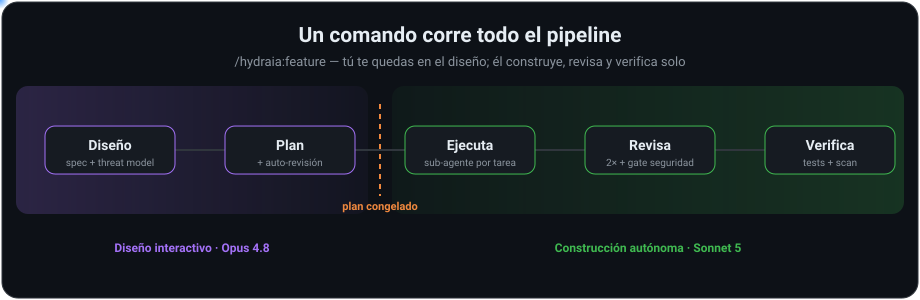

# Hydraia


[](https://discord.gg/gA9TBsjGz)

🇬🇧 [English](README.md) · 🇪🇸 Español

Un arnés de desarrollo agéntico para Claude Code. **Un solo comando corre todo el
pipeline** — colabora contigo en el diseño y luego construye de forma autónoma:
planifica, ejecuta, revisa dos veces y verifica. Sin niñeras paso a paso, sin
elegir qué modelo o skill usar.

```
/hydraia:feature add rate limiting to the public REST API
```

Tú te quedas en Opus 4.8; Hydraia decide lo demás — cuándo hacer lluvia de ideas,
cuándo planificar, cuándo bajar a Sonnet para ejecutar, qué revisores correr, qué
gates de seguridad exigir.



---

## Para qué sirve

Claude Code en crudo es potente pero manual: **tú** te acuerdas de planear, de
hacer threat model, de revisar, de testear — cada paso manual, cada paso saltable
bajo presión. Hydraia aplica **la disciplina de tu mejor día, en cada corrida**.
Un comando corre un pipeline fijo — pensar → diseño + threat model → plan →
ejecutar → doble revisión → verificar — con cada decisión de modelo y revisor ya
tomada, y un **gate de seguridad siempre activo y no configurable**.

| Fase | Qué pasa | Modelo |
|------|----------|--------|
| Diseño | Lluvia de ideas → spec + threat model | Opus 4.8 |
| Plan | Plan detallado + auto-revisión, luego **congelado** | Opus 4.8 |
| Ejecuta | Sub-agente nuevo por tarea | Sonnet 5 |
| Revisa | Revisores de rama completa + por-diff + gate de seguridad | Opus (+ Sonnet/Haiku) |
| Verifica | Tests, chequeo contra spec, scan de secrets/deps | Opus 4.8 |

---

## Instalación

**Requisitos previos** (instálalos antes de Hydraia): Claude Code, `git`,
Node.js ≥18 y Python 3.8+. `codegraph` y `markitdown` los instala por ti
`/hydraia:doctor`. Plataforma: macOS/Linux (Windows vía WSL).

Agrega el marketplace e instala el plugin — dentro de la CLI de Claude Code o en
tu terminal:

```bash
claude plugin marketplace add jdanigo/hydraia
claude plugin install hydraia
```

Luego corre `/hydraia:doctor` una vez para validar e instalar dependencias
externas. Listo — cada skill y agente vive dentro del plugin.

---

## Comandos

| Comando | Qué hace |
|---------|----------|
| `/hydraia:feature <desc>` | Pipeline completo: contexto → diseño → plan → build → doble review + seguridad → verify |
| `/hydraia:plan <desc>` | Diseño + threat model + plan detallado, luego **para** (no ejecuta) |
| `/hydraia:agile <idea>` | Descompone un épico en historias/tareas y lo entrega solo, por etapas |
| `/hydraia:explainme <foco>` | Mapa HTML interactivo de un repo/PR (onboarding en 10 min) |
| `/hydraia:review [foco]` | Doble review + gate de seguridad sobre la rama actual |
| `/hydraia:graph <query>` | Consulta el code graph (call sites, blast radius) — sin correr el pipeline |
| `/hydraia:resume` | Retoma un run interrumpido desde la última fase incompleta |

`/hydraia:doctor` valida dependencias; hay más comandos especialistas (`perf`,
`db`, `architect`, `story`, `e2e`, `devops`, `observability`, `docs`,
`dashboard`) para trabajo enfocado.

---

## Casos de uso prácticos

**Entrega una feature de punta a punta**
```
/hydraia:feature add rate limiting to the public REST API — 100 req/min por key
```
Planeada, construida, revisada dos veces, con gate de seguridad y verificada — un comando.

**Congela el enfoque antes de escribir código**
```
/hydraia:plan migrar el cache de sesión de memoria a Redis
```
Obtienes spec + threat model + plan congelado, sin ejecutar nada. Corre
`/hydraia:feature` cuando estés conforme.

**Revisa una rama que no construiste con Hydraia**
```
/hydraia:review el módulo de auth
```
Review de rama completa + por-diff con el gate de seguridad obligatorio.

**Entiende el blast radius antes de tocar algo**
```
/hydraia:graph qué llama a parseConfig y qué se rompe si cambio su firma
```

**Convierte un repo en un mapa de onboarding**
```
/hydraia:explainme el subsistema de pagos
```

---

## Comunidad

Dudas, ideas, proyectos y novedades de las releases viven en el Discord de
Hydraia — pásate a saludar:

**[💬 Únete al Discord de Hydraia](https://discord.gg/gA9TBsjGz)**

---

## Más

- [CHANGELOG](CHANGELOG.md) — historial completo de releases
- [CONTRIBUTING](CONTRIBUTING.md) — estructura del repo + cómo agregar un skill
- Licencia: [MIT](LICENSE) (código propio de Hydraia); skills/agentes upstream atribuidos en [NOTICE](NOTICE)
- Los skills se pueden instalar en otros agentes vía `npx skills` (layout `skills/<name>/SKILL.md`)
- Hay un port a Codex CLI como preview experimental (`codex/`)
