# Hydraia


[](https://discord.gg/gA9TBsjGz)

🇬🇧 English · 🇪🇸 [Español](README.es.md)

An agentic development harness for Claude Code. **One command runs the entire
feature pipeline** — it collaborates with you on the design, then builds
autonomously: plan, execute, double-review, and verify. No per-step babysitting,
no choosing which model or skill to use.

```
/hydraia:feature add rate limiting to the public REST API
```

You stay on Opus 4.8; Hydraia decides the rest — when to brainstorm, when to
plan, when to drop to Sonnet for execution, which reviewers to run, which
security gates to enforce.



---

## What it's for

Raw Claude Code is powerful but hands-on: **you** remember to plan, to
threat-model, to review, to test — every step manual, every step skippable under
pressure. Hydraia applies **the discipline you'd use on your best day, on every
run**. One command runs a fixed pipeline — think → design + threat model → plan →
execute → double review → verify — with every model and reviewer decision already
made, and a **security gate that is always on and never configurable**.

| Phase | What happens | Model |
|-------|--------------|-------|
| Design | Brainstorm → spec + threat model | Opus 4.8 |
| Plan | Detailed plan + self-review, then **frozen** | Opus 4.8 |
| Execute | Fresh sub-agent per task | Sonnet 5 |
| Review | Whole-branch + diff-scoped reviewers + security gate | Opus (+ Sonnet/Haiku) |
| Verify | Tests, spec check, secrets/deps scan | Opus 4.8 |

---

## Install

**Prerequisites** (install before Hydraia): Claude Code, `git`, Node.js ≥18, and
Python 3.8+. `codegraph` and `markitdown` are installed for you by
`/hydraia:doctor`. Platform: macOS/Linux (Windows via WSL).

Add the marketplace and install the plugin — inside the Claude Code CLI or your
terminal:

```bash
claude plugin marketplace add jdanigo/hydraia
claude plugin install hydraia
```

Then run `/hydraia:doctor` once to validate and install external deps. That's it —
every skill and agent ships inside the plugin.

---

## Commands

| Command | What it does |
|---------|--------------|
| `/hydraia:feature <desc>` | Full pipeline: context → design → plan → build → double review + security → verify |
| `/hydraia:plan <desc>` | Design + threat model + detailed plan, then **stop** (nothing executed) |
| `/hydraia:agile <idea>` | Decompose an epic into stories/tasks and deliver it autonomously, stage by stage |
| `/hydraia:explainme <focus>` | Interactive HTML map of a codebase/PR (onboarding in 10 min) |
| `/hydraia:review [focus]` | Double review + security gate on the current branch |
| `/hydraia:graph <query>` | Query the code graph (call sites, blast radius) — no pipeline run |
| `/hydraia:resume` | Continue an interrupted run from the last incomplete phase |

`/hydraia:doctor` validates deps; more specialist entries (`perf`, `db`,
`architect`, `story`, `e2e`, `devops`, `observability`, `docs`, `dashboard`)
exist for focused work.

---

## Practical use cases

**Ship a feature, end to end**
```
/hydraia:feature add rate limiting to the public REST API — 100 req/min per key
```
Planned, built, reviewed twice, security-gated, and verified — one command.

**Lock the approach before writing code**
```
/hydraia:plan migrate the session cache from in-memory to Redis
```
You get a spec + threat model + frozen plan and nothing is executed. Run
`/hydraia:feature` when you're happy.

**Review a branch you didn't build with Hydraia**
```
/hydraia:review the auth module
```
Whole-branch + diff-scoped review with the mandatory security gate.

**Understand blast radius before touching anything**
```
/hydraia:graph what calls parseConfig and what breaks if I change its signature
```

**Turn a codebase into an onboarding map**
```
/hydraia:explainme the payments subsystem
```

---

## Community

Questions, ideas, showcases, and release news live in the Hydraia Discord —
come say hi:

**[💬 Join the Hydraia Discord](https://discord.gg/gA9TBsjGz)**

---

## More

- [CHANGELOG](CHANGELOG.md) — full release history
- [CONTRIBUTING](CONTRIBUTING.md) — repo structure + how to add a skill
- License: [MIT](LICENSE) (Hydraia's own code); upstream skills/agents attributed in [NOTICE](NOTICE)
- Individual skills are installable into other agents via `npx skills` (`skills/<name>/SKILL.md` layout)
- A Codex CLI port is available as an experimental preview (`codex/`)
